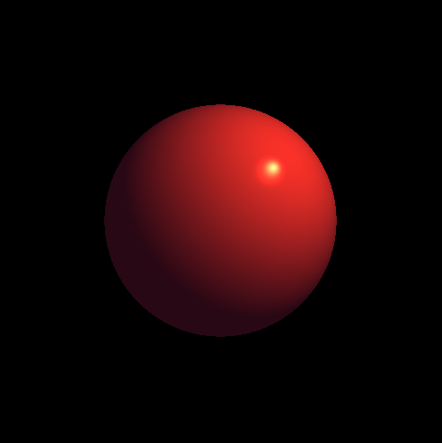

# RayTracer

Python project rendering a sphere with Phong Shading. The challenge was to render an image using no external dependancies, only python standard library. Each pixel color is calculated and the result is written pixel by pixel in a human readable image file format.

## Install and launch

Developped with Python 3.7.4, no other dependancies

Launch with :
`python raytracer.py`

This will render the image and write it in a .ppm file. The scene layout can be changed in main.py.

## Description

This is a very basic ray tracer, it features:
- One static camera at origine pointing towards +y
- One Light
- One Sphere

For each pixel of the camera, a ray is shot. If it intersects the sphere (i.e. if the ray pass by closer to the sphere than the sphere radius), then we compute the intersection point. This can be done with basic trigonometry.

Once we have the intersection point, we can easily compute its normal and distance to the light and then compute its color with Phongs's shader equations.

For each pixel, the color is written in a ppm file which enable straightforward visualisation.

Result image:

## Todo

- Render multiple assets (asset list)
- Occlusion
- Anti-aliasing
- Render triangle 
    - Detect intersection 
        - https://www.scratchapixel.com/lessons/3d-basic-rendering/rasterization-practical-implementation/rasterization-stage)
        -  https://www.scratchapixel.com/lessons/3d-basic-rendering/ray-tracing-rendering-a-triangle/ray-triangle-intersection-geometric-solution       -
